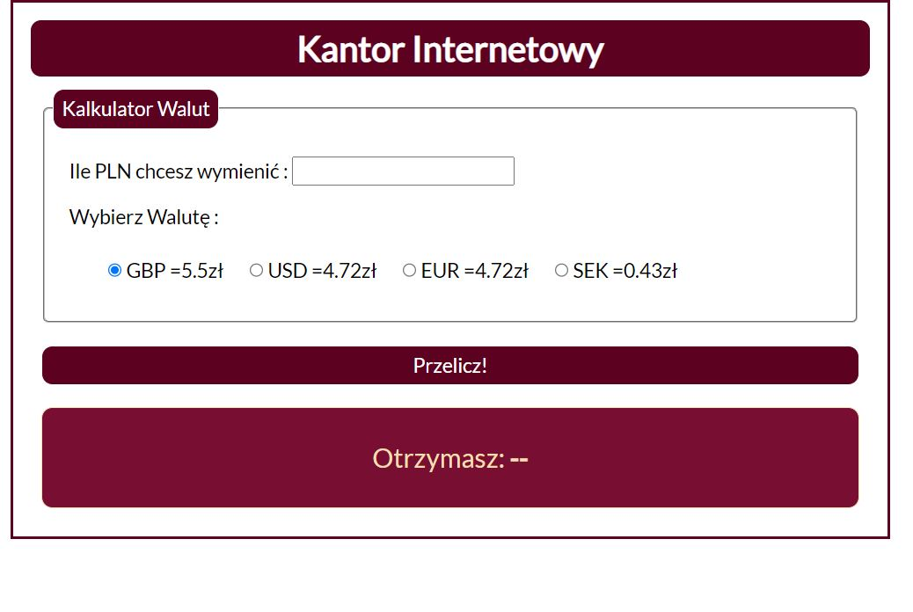
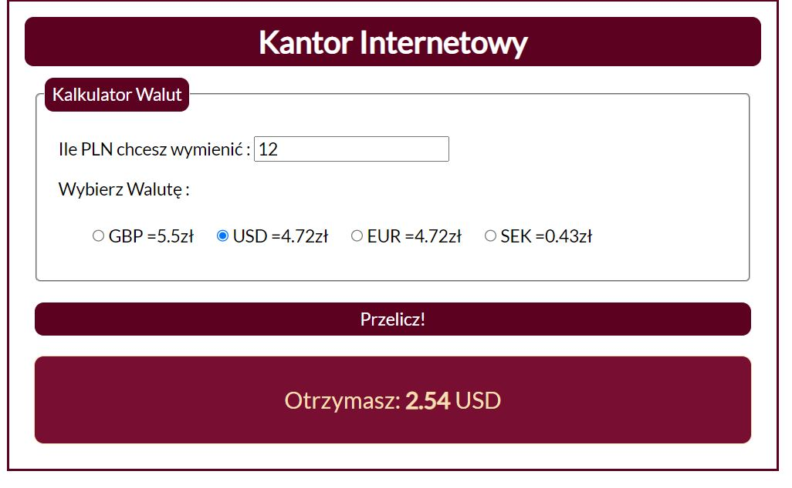

# Currency Converter

### DEMO: http://izabelaborkowska.repository/

### Description:
This simple currency converter is my second project as part of my Youcode Course. 
You can calculate how much of USD/EUR/SEK/EUR you would get by putting the amount of PLN you have. 
The calculator will do the math for you. 

In this project I used: 
- HTML
- CSS
- Java Script

